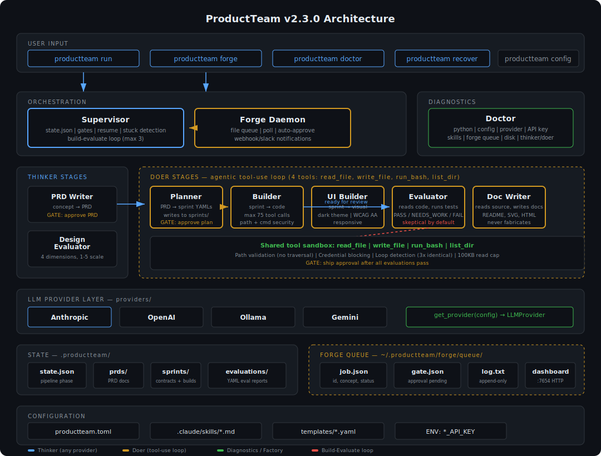

# ProductTeam

**Turn a product concept into shipping code.**

ProductTeam is a standalone AI-powered product development pipeline. You describe what you want to build. It writes the PRD, plans the sprints, builds the code, evaluates the results, writes the docs, and ships. Eight specialized agents, three approval gates, one CLI. No Claude Code required — works with Anthropic, OpenAI, Ollama (free/local), or Gemini.

## Install

```bash
pip install productteam
```

Requires Python 3.11+.

## Quick Start

```bash
# Initialize a project
productteam init

# Configure your provider
productteam config set pipeline.provider anthropic
# Set your API key
export ANTHROPIC_API_KEY=sk-ant-...

# Run the full pipeline
productteam run "a CLI tool that estimates LLM API costs"

# Or resume from where you left off
productteam run

# Check your environment
productteam doctor
```

## The Pipeline

```
You: "I want a tool that does X"
  |
  v
PRD Writer  -->  Planner  -->  Builder <-> Evaluator  -->  Doc Writer  -->  Ship
                                  (max 3 loops)
```

**Three approval gates.** You stop three times:

| Gate | When | You Decide |
|------|------|-----------|
| PRD Approval | After PRD is written | "Does this capture my intent?" |
| Sprint Approval | After sprints are planned | "Does this scope look right?" |
| Ship Approval | After all evaluations pass | "Ready to push?" |

Everything between gates runs automatically.

## Thinker/Doer Architecture

This is the core design decision. Stages split into two types:

| Stage | Type | How It Runs |
|-------|------|-------------|
| PRD Writer | Thinker | Single LLM call, structured text output |
| Planner | Thinker | Single LLM call, structured text output |
| Design Evaluator | Thinker | Single LLM call, structured text output |
| **Builder** | **Doer** | **Tool-use loop** (read/write files, run commands) |
| **UI Builder** | **Doer** | **Tool-use loop** (read/write files, run commands) |
| **Evaluator** | **Doer** | **Tool-use loop** (reads code, runs tests, grades) |
| **Doc Writer** | **Doer** | **Tool-use loop** (reads source, writes docs) |

**Thinker stages** support all configured providers (Anthropic, OpenAI, Ollama, Gemini). Single `provider.complete()` call — context in, text artifact out.

**Doer stages** run an agentic tool-use loop with exactly four tools: `read_file`, `write_file`, `run_bash`, `list_dir`. The LLM calls tools, the supervisor executes them, results go back to the LLM, repeat until the agent finishes. The Evaluator uses this to read actual source files and run tests. The Doc Writer uses it to read code before writing documentation.

## How It Really Works



### The Supervisor (`supervisor.py`)

The orchestrator. When you run `productteam run "concept"`, the Supervisor reads your config, loads pipeline state from `state.json`, and launches each stage in sequence. It enforces three approval gates (PRD, Sprint, Ship), manages the build-evaluate loop (max 3 iterations), detects stuck agents (timeout, infinite loops, max tool calls), and writes state on every change so you can resume with `productteam run`.

### The Tool Loop (`tool_loop.py`)

The agentic runtime for all doer stages (Builder, UI Builder, Evaluator, Doc Writer). Exactly four tools:

- **`read_file`** — Read any file in the project. Path must be relative, no `..` traversal.
- **`write_file`** — Write content to a file. Creates parent directories.
- **`run_bash`** — Run a shell command with timeout. Blocks access to `.ssh/`, `.aws/`, credential paths.
- **`list_dir`** — List directory contents with `[FILE]` and `[DIR]` prefixes.

The loop calls the LLM, executes any tool calls, sends results back, and repeats until the LLM stops calling tools. Safety: path validation rejects traversal and absolute paths. Command validation blocks credential-adjacent paths. Loop detection catches identical tool+args called 3 times consecutively. Max 50 tool calls per run (configurable).

### Forge (`forge/`)

Three components for headless pipeline execution:

- **Queue** (`queue.py`) — File-based at `~/.productteam/forge/queue/`. Each job is a directory with `job.json`, `gate.json`, and `log.txt`. Zero infrastructure.
- **Daemon** (`daemon.py`) — Polls queue every 10 seconds. Creates a project, runs init, starts Supervisor with auto-approve. At gates, writes `gate.json` and sends webhook/Slack notifications.
- **Dashboard** (`dashboard.py`) — Stdlib `http.server` at `http://0.0.0.0:7654` (LAN-accessible by default). Job table, live log tailing, approve/reject buttons, and a **submit form** — type an idea and hit "Forge it" from any device on your network. No framework, no build step. The CLI prints your local IP so you know the URL to use from your phone.

### Provider Layer (`providers/`)

Abstract `LLMProvider` with `complete()` (thinkers) and `complete_with_tools()` (doers). Four implementations: Anthropic (SDK), OpenAI-compatible (httpx), Ollama (native API), Gemini (REST). Factory function `get_provider(config)` reads `productteam.toml` and returns the right one. API keys from environment variables only.

### Doctor (`doctor.py`)

`productteam doctor` checks 8 things: Python version, package version, config validity, `.productteam/` directory, skills (all 8 present), provider + API key, forge queue health, disk space. Prints the thinker/doer note unconditionally. Exit code 1 on critical failures. `--json` for scripting, `--no-network` to skip API checks.

### State (`state.json`)

Written by the Supervisor on every state change. Records pipeline phase, completed stages, current sprint, loop iteration, timestamps. `productteam run` without a concept reads this and resumes. Passed sprints are skipped. `--rebuild` forces full rebuild.

## CLI Reference

### `productteam init [DIRECTORY]`

Initialize ProductTeam in a project directory.

```
Options:
  --force, -f    Overwrite existing files

Examples:
  productteam init
  productteam init ./my-project
  productteam init --force
```

### `productteam run [CONCEPT] [OPTIONS]`

Run the full product development pipeline.

```
Arguments:
  CONCEPT    The product concept to build. Optional if resuming.

Options:
  --step        Run only a specific stage (prd|plan|build|evaluate|document|ship)
  --sprint      Target a specific sprint (with --step build or evaluate)
  --auto-approve   Skip interactive approval gates
  --rebuild     Force rebuild even if a sprint has already passed
  --dry-run     Show what would happen without calling the LLM
  --dir, -d     Project directory (default: current directory)

Examples:
  productteam run "a CLI tool that estimates LLM API costs"
  productteam run                          # resume from current state
  productteam run --step prd               # rewrite the PRD only
  productteam run --auto-approve           # headless / CI mode
  productteam run --rebuild --sprint sprint-002
```

### `productteam status [DIRECTORY]`

Show pipeline status for the current project.

```
Examples:
  productteam status
  productteam status ./my-project
```

### `productteam doctor`

Check ProductTeam environment and configuration.

```
Options:
  --no-network   Skip API reachability checks
  --json         Output as JSON for scripting
  --dir, -d      Project directory

Examples:
  productteam doctor
  productteam doctor --json
  productteam doctor --no-network
```

### `productteam config`

Show current productteam.toml settings.

### `productteam config set KEY VALUE`

Set a configuration value.

```
Examples:
  productteam config set pipeline.provider openai
  productteam config set pipeline.model claude-opus-4-6
  productteam config set pipeline.max_loops 5
  productteam config set gates.prd_approval false
```

### `productteam forge "CONCEPT"`

Submit an idea to Forge. Returns a job ID.

```
Examples:
  productteam forge "An app that tracks local ballot measures"
```

### `productteam forge --listen [--dashboard]`

Start the Forge daemon. Watches for queued jobs and runs them headlessly.

```
Options:
  --dashboard    Enable the status dashboard (default: http://0.0.0.0:7654)

Examples:
  productteam forge --listen
  productteam forge --listen --dashboard

The dashboard is accessible from any device on your local network. When it
starts, the CLI prints both the localhost URL and your LAN IP:

  Dashboard: http://localhost:7654
  From phone: http://192.168.1.42:7654

Open that URL on your phone to submit ideas, check status, and approve gates.
```

### `productteam forge status [JOB-ID]`

Show all jobs or detailed status for one job.

### `productteam forge approve JOB-ID`

Approve a gate for a waiting job.

### `productteam forge reject JOB-ID`

Reject a gate and fail the job.

### `productteam forge logs JOB-ID`

Tail the log for a job.

```
Options:
  --tail, -n    Number of lines (default: 50)
```

### `productteam test [OPTIONS]`

Run the ProductTeam test suite.

```
Options:
  --live              Run live integration tests (makes real API calls)
  --provider, -p      LLM provider for live tests (anthropic|openai|ollama|gemini)
  --model, -m         Model override for live tests
  --verbose, -v       Verbose pytest output
  --cov               Run with coverage reporting
  -k EXPRESSION       pytest -k filter expression
  --dir, -d           Project directory

Examples:
  productteam test                          # offline unit tests only
  productteam test --live                   # live tests (costs money)
  productteam test --live -p ollama         # live tests against local Ollama
  productteam test -v --cov                 # verbose with coverage
  productteam test -k "test_supervisor"     # run specific tests
```

Live mode shows a safety warning before running, displays your masked API key, and defaults to the cheapest available model (Haiku for Anthropic).

## Forge

Forge is how you use ProductTeam from your phone. Submit an idea from anywhere. It comes back a product.

```bash
# On your machine, start the daemon with the dashboard
productteam forge --listen --dashboard
# Dashboard: http://localhost:7654
# From phone: http://192.168.1.42:7654
```

**Three ways to submit ideas:**

1. **From your phone's browser** — Open `http://<your-ip>:7654`, type your idea in the submit form, hit "Forge it"
2. **From the CLI** — `productteam forge "An app that tracks local ballot measures"`
3. **From GitHub** — Create an issue with the `productteam-forge` label (requires `github_issues` queue backend)

```bash
# Check status from anywhere
productteam forge status a1b2c3d4

# Approve gates when notified (or use the dashboard buttons)
productteam forge approve a1b2c3d4
```

**Queue backends:**
- `file` (default) — zero infrastructure, queue lives at `~/.productteam/forge/queue/`
- `github_issues` — uses GitHub Issues with the `productteam-forge` label

**Notification backends:**
- `none` (default)
- `webhook` — POST JSON to any URL
- `slack` — POST to a Slack webhook

## Configuration

All configuration lives in `productteam.toml`:

```toml
[project]
name = "my-app"
version = "0.1.0"

[pipeline]
provider = "anthropic"          # anthropic | openai | ollama | gemini
model = "claude-sonnet-4-6"
api_base = ""                   # for openai-compatible servers
max_loops = 3                   # build-evaluate loop limit
require_evaluator = true
require_design_review = true
stage_timeout_seconds = 120     # thinker stage timeout
builder_timeout_seconds = 300   # doer stage wall time
builder_max_tool_calls = 50     # tool call limit per builder run
auto_approve = false            # skip approval gates

[gates]
prd_approval = true
sprint_approval = true
ship_approval = true

[forge]
enabled = false
queue_backend = "file"          # file | github_issues
notification_backend = "none"   # none | webhook | slack
notification_url = ""
status_host = "0.0.0.0"        # "127.0.0.1" for localhost only
status_port = 7654
github_repo = ""
poll_interval_seconds = 10
```

> **Security note:** The dashboard binds to `0.0.0.0` by default — accessible to all devices on your LAN. Anyone on your network can view jobs, submit ideas, approve gates, and read log output. On shared or public networks, set `status_host = "127.0.0.1"` to restrict access to localhost only.

## Multi-Provider Setup

### Anthropic (default)

```bash
export ANTHROPIC_API_KEY=sk-ant-...
productteam config set pipeline.provider anthropic
productteam config set pipeline.model claude-sonnet-4-6
```

### OpenAI

```bash
export OPENAI_API_KEY=sk-...
productteam config set pipeline.provider openai
productteam config set pipeline.model gpt-4o
```

### Ollama (local, no API key)

```bash
# Start Ollama first: ollama serve
productteam config set pipeline.provider ollama
productteam config set pipeline.model llama3
```

### Gemini

```bash
export GEMINI_API_KEY=...
productteam config set pipeline.provider gemini
productteam config set pipeline.model gemini-2.0-flash
```

### OpenAI-Compatible (LM Studio, vLLM, etc.)

```bash
productteam config set pipeline.provider openai
productteam config set pipeline.model local-model
productteam config set pipeline.api_base http://localhost:1234/v1
```

## The Team (8 Skills)

| Skill | Role | What It Does |
|-------|------|-------------|
| `prd-writer` | Product Manager | Converts concept to structured PRD |
| `planner` | Tech Lead | Decomposes PRD into sprint contracts |
| `builder` | Engineer | Implements code via tool-use loop |
| `ui-builder` | Frontend Engineer | Builds visual artifacts via tool-use loop |
| `evaluator` | QA Engineer | Verifies code against sprint contract |
| `evaluator-design` | Design Reviewer | Grades visual work on 4 dimensions |
| `doc-writer` | Technical Writer | Writes README, docs, changelog from code |
| `orchestrator` | Project Manager | Routes work, manages loops and gates |

## License

MIT

## Author

Scott Converse
